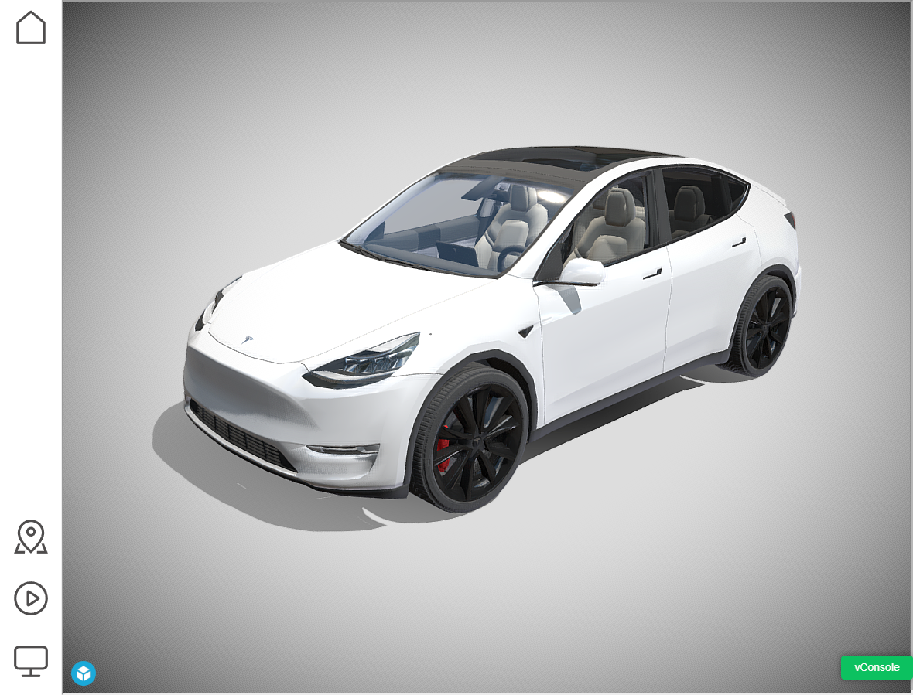
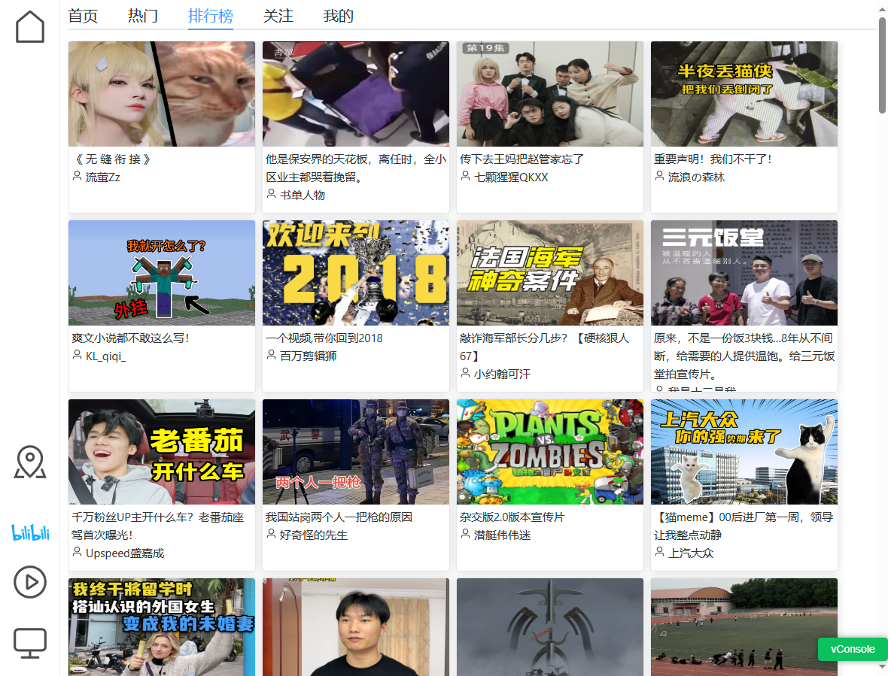
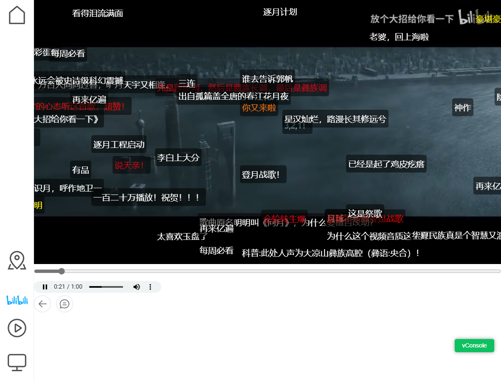
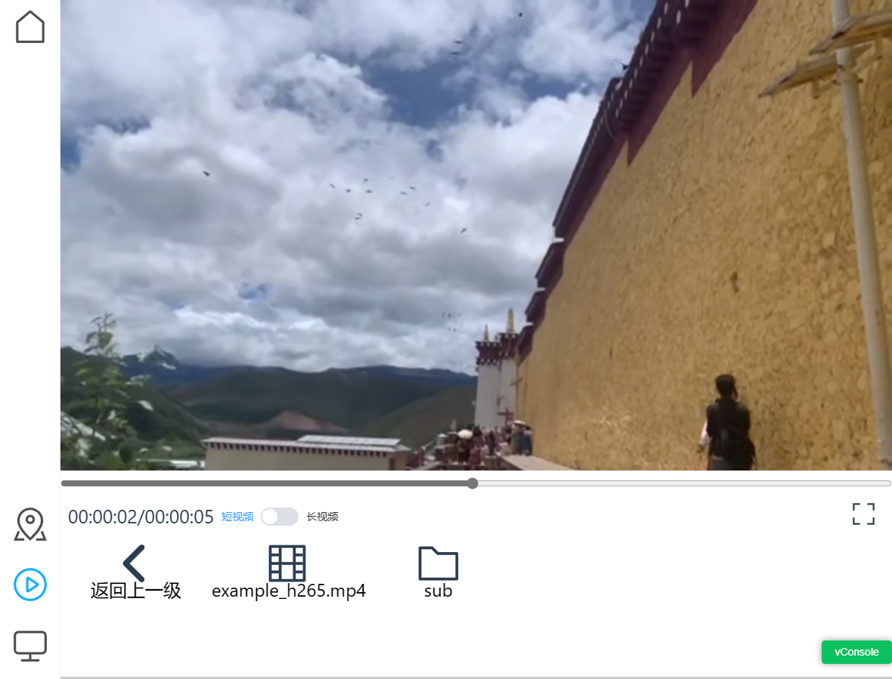
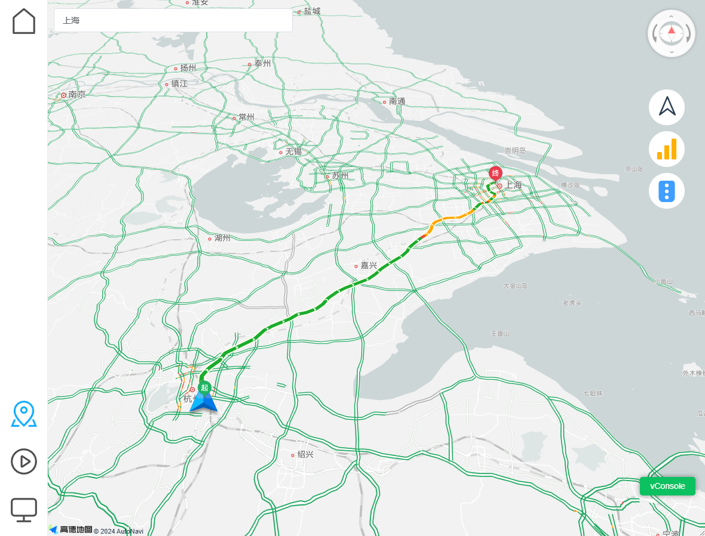
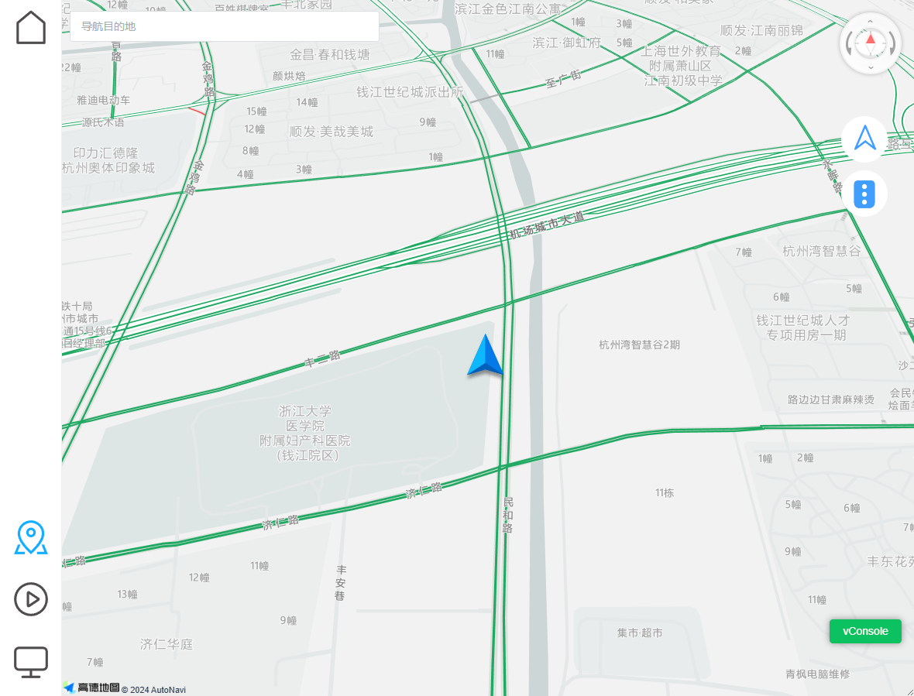

### 简介
tesla-media-center是一个开源解决方案，将更强大的多媒体功能搬到车机浏览器，包括视频软解码（D档支持）、高德路线规划等功能。

## 免责声明
本解决方案（包括相关的所有代码和文档，以下简称“解决方案”）旨在提供给用户（以下简称“用户”）用于搭建和管理网站的方法。本解决方案的开发初衷是提供辅助工具提升网站建设的效率，并且基于此建设的网络服务应该提供给乘客，而非在任何情况下，特别是在驾驶或操作车辆时分散用户（驾驶员）的注意力。

用户在驾驶或操作任何形式的车辆时，应始终保持全神贯注于行驶安全，严格遵守所有适用的交通安全规定和法律要求。用户明确同意，任何因驾驶或操作车辆时使用或误用本解决方案而导致的直接或间接后果、损害、事故或责任，均由用户个人承担全部责任，解决方案的开发者、分发者或任何关联方不承担任何责任。

使用本解决方案即表示用户已经理解并同意：

（1）本解决方案不应在任何可能会干扰驾驶或车辆操作安全的情况下使用；

（2）用户完全理解并接受使用本解决方案产生的所有风险；

（3）用户对自身安全及他人安全负有最终责任。


### 功能说明
#### 主页3D车模

通过config中的home_page_iframe可以配置不同的主页，可以去sketchfab找些带动画的3D模型作为主页https://sketchfab.com/search?features=animated&type=models

### bilibili在线播放



提供bilibili在线播放功能。

使用服务端转码，前端使用jsmpeg

已知问题：
1. ~~由于mp1编码压缩率不高，在3M小水管下画质不佳，后续考虑换h264~~ 通过调节ffmpeg质量参数解决
2. 功能缺失，完全复刻bilibili客户端是巨大的工作量，后续可能仅做几个核心功能
3. 由于目前方案是服务端实时转码，暂不支持seek跳转，暂停/恢复
4. ~~下载线程中断会导致死锁~~ 已经修复
5. 由于实时转码，下载线程和转码线程是同步的，过长的下载事件可能会导致下载失败
6. 车载网络波动导致的缺帧

#### h264/h265 mp4/flv 点播视频播放


由于网络视频是流式播放的，所以需要将moov box前置

使用如下ffmpeg命令对视频进行转码。

ffmpeg命令可以从ffmpeg官网下载：https://ffmpeg.org/download.html
```
ffmpeg -i .\test.mp4 -codec:v hevc -codec:a aac -b:v 512k -b:a 128k -s 1100x624 -r 25 -movflags faststart  output.mp4
```
已支持：
1. h264/h265视频播放

已知问题：
1. 视频需要moov box前置，基本上都需要使用ffmpeg转换后才能使用
2. 目前本播放器仅支持h264/h265的flv/mp4视频，并且时长不能超过1小时
3. 视频播放完毕后，进度条仍然会继续
4. 弱网环境下，可能会音画不同步，通过手动指定播放时间可以再次让音画同步

原始播放器地址：https://github.com/sonysuqin/WasmVideoPlayer

#### 高德地图


高德地图的api key需要自己去高德开发者平台申请：https://console.amap.com/dev/key/app
如需获得tesla浏览器的GPS地址，需要https协议访问，相关域名申请和证书申请请自行百度谷歌

已支持:
1. 支持目的地搜索和路线规划
2. 支持实时路况
3. 支持GPS信号低提醒
4. 支持地图移动、拖拽、视角调整，支持车头朝上

已知问题：
1. 走错路不会重新规划
2. 切换tab后，原规划的目的地、路线消失
3. 没有限速信息等额外信息


### docker运行说明
```
docker run -it -p 8080:8080 -v ./config.json:/root/tesla-media-center/config.json -v ./video:/root/tesla-media-center/video  registry.cn-hangzhou.aliyuncs.com/helloclyde/tesla-media-center:latest
```
其中./config.json是自己的config配置文件; ./video是自己的本地视频目录文件夹

config.json配置文件内容如下：
```json
{
    "home_page_iframe": "https://sketchfab.com/models/de2fc0824eb140ccb63c5b215797b996/embed?autostart=1&internal=1&tracking=0&ui_infos=0&ui_snapshots=1&ui_stop=0&ui_watermark=0",
    "video_path": "./video",
    "amap_key": "xxx",
    "password": "abc"
}
```
其中amap_key是高德开发者key，用于高德地图相关api调用，如果没有，就随便写个，只是地图部分无法使用

video_path是本地视频目录存放地址，无需更改

home_page_iframe是主页展示的url，不知道写什么就用样例默认即可

password就是该web服务的密码，自己设置一个


### 开发环境build
这里以centos系统举例，windonws系统请自己查询对应依赖的安装方法
1.  下载代码
```
yum install git -y
git clone https://github.com/HelloClyde/tesla-media-center.git
```
2. 使用miniconda创建python环境[可选]
```
wget https://repo.anaconda.com/miniconda/Miniconda3-latest-Linux-x86_64.sh
sh Miniconda3-latest-Linux-x86_64.sh
# 一路yes,安装完毕后退出shell重进，让conda命令生效
# 创建并且激活环境
conda create -n tmc python=3.10
conda activate tmc
```
4. 安装python依赖
```
cd tesla-media-center
pip install -r requirement.txt 
```
5. 安装nodejs并且编译前端代码
```
yum install nodejs npm -y
# 设置淘宝镜像
npm config set registry https://registry.npmmirror.com

cd web
# 使用npm安装前端依赖
npm install
# 编译前端代码
npm run build
cd ..
```

6. 设置配置文件，在tesla-media-center文件夹下面创建config.json配置文件
文件内容如下
```json
{
    "home_page_iframe": "https://sketchfab.com/models/de2fc0824eb140ccb63c5b215797b996/embed?autostart=1&internal=1&tracking=0&ui_infos=0&ui_snapshots=1&ui_stop=0&ui_watermark=0",
    "video_path": "./video",
    "amap_key": "xxx",
    "password": "abc"
}
```
其中amap_key是高德开发者key，用于高德地图相关api调用，如果没有，地图部分无法使用
video_path是本地视频目录存放地址
home_page_iframe是主页展示的url

7. 启动web服务
```
python main.py
```
