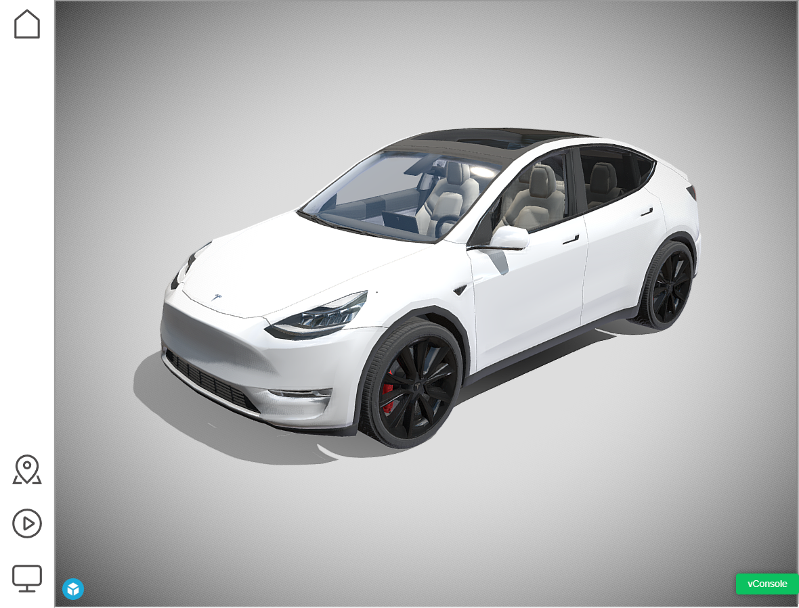
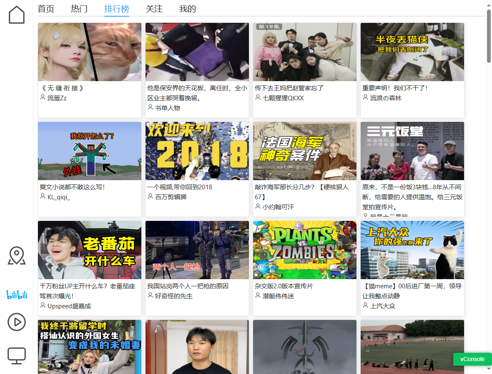
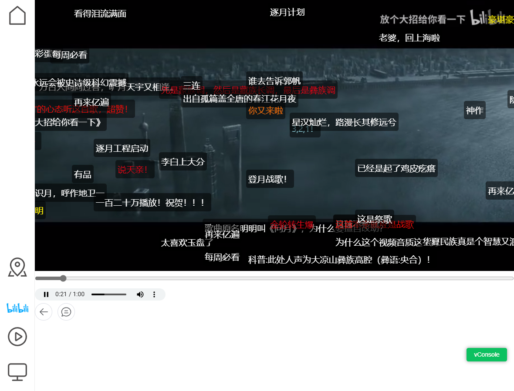
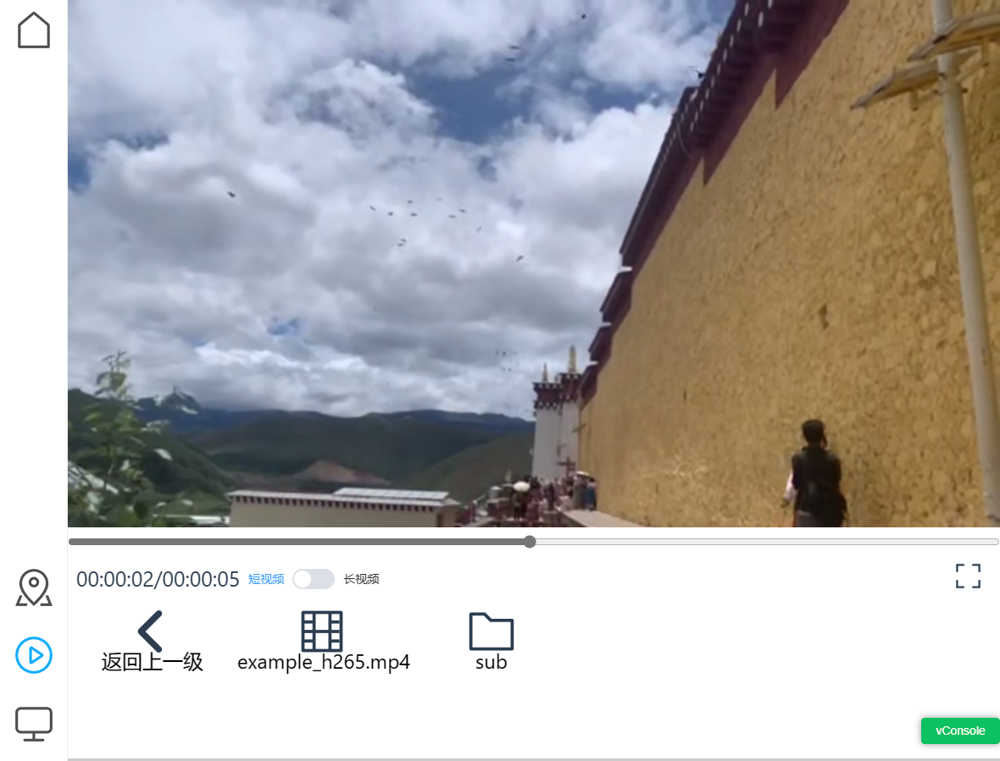
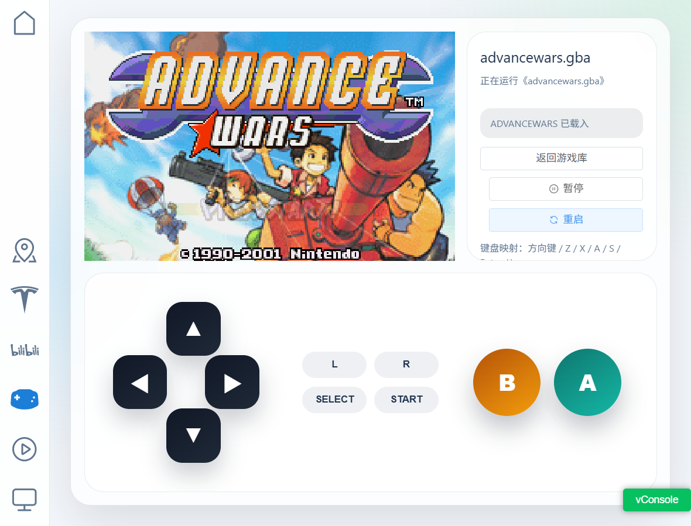
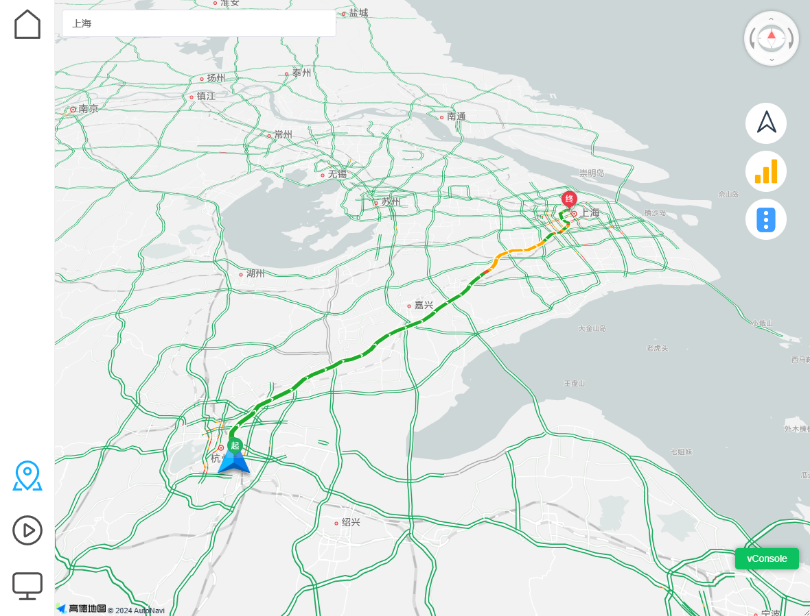
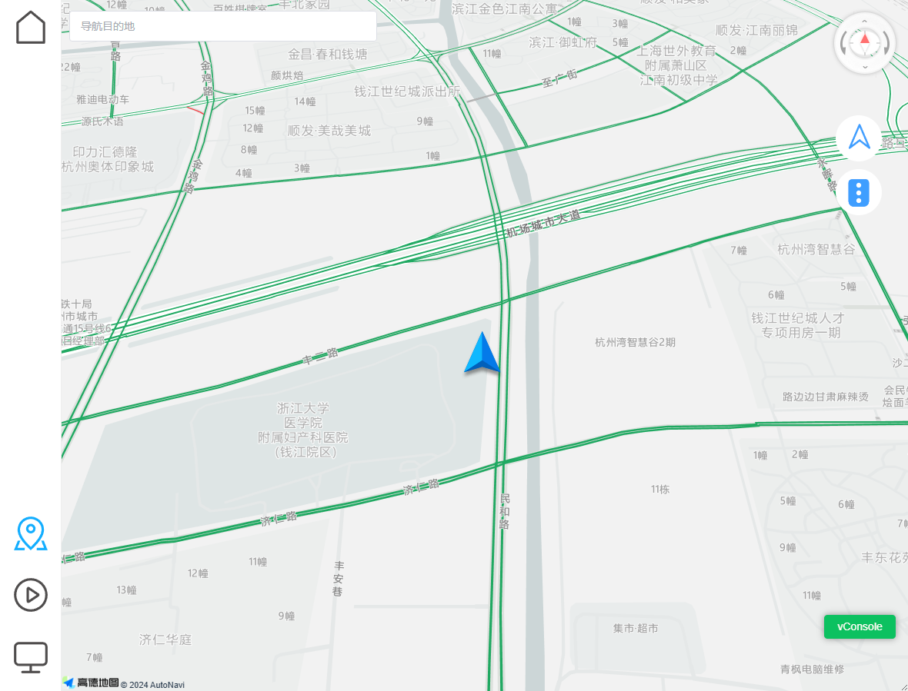

# Tesla Media Center

面向车机浏览器的开源多媒体中心，提供本地视频、B 站、Tesla 状态与轨迹、GBA 模拟器、高德地图路线规划等能力。

## 目录

- [项目简介](#项目简介)
- [功能概览](#功能概览)
- [快速开始](#快速开始)
- [Docker 部署](#docker-部署)
- [配置说明](#配置说明)
- [开发环境](#开发环境)
- [镜像构建](#镜像构建)
- [已知限制](#已知限制)
- [免责声明](#免责声明)

## 项目简介

Tesla Media Center 主要面向横屏车机和车载浏览器场景，重点解决以下几类需求：

1. 本地媒体播放
2. B 站视频在线播放和缓存管理
3. Tesla 车辆状态、轨迹、行程记录
4. 车机适配的 GBA 模拟器
5. 地图搜索与路线规划

当前版本已经支持：

1. B 站首页、热门、排行榜、搜索、番剧 / 分 P 播放
2. B 站自动续播、弹幕控制、缓存容量限制和一键清理
3. 本地 `mp4 / flv` 视频播放与目录浏览
4. Tesla `Owner API` token 模式接入、状态 / 轨迹 / 行程 / 原始数据查看
5. 后台轮询写入 SQLite，并支持记录保留策略与存储清理
6. GBA 本地游戏库与 `gba.js.org` 在线 ROM 补充库
7. 高德地图目的地搜索、路线规划和 GPS 展示
8. 跟随系统的白天 / 夜间主题
9. GitHub Actions 自动构建并推送 Docker 镜像到 GHCR / 阿里云 ACR

## 功能概览

### 首页 3D 车模

首页支持通过 `config.json` 中的 `home_page_iframe` 自定义展示内容，默认示例使用 Sketchfab 3D 模型。

- 适合放置 3D 车模、品牌页、信息看板
- 支持直接替换为你自己的 iframe 页面



### B 站在线播放

服务端负责拉流、转码和缓存，前端使用 wasm 播放器进行播放控制。

- 首页、热门、排行榜、搜索
- 搜索与热门自动翻页加载
- 分 P / 番剧 EP 切换
- 自动续播下一集
- 弹幕位置、透明度、同屏数量控制
- B 站登录、关注、收藏、缓存管理




### 本地视频播放

- 本地目录浏览
- `h264 / h265` 的 `mp4 / flv` 播放
- 基于 wasm 的软解播放



如果视频是流式点播，建议将 `moov box` 前置：

```bash
ffmpeg -i test.mp4 -codec:v hevc -codec:a aac -b:v 512k -b:a 128k -s 1100x624 -r 25 -movflags faststart output.mp4
```

原始播放器项目：
https://github.com/sonysuqin/WasmVideoPlayer

### Tesla 状态与轨迹

当前实现兼容个人用户常见的 `Owner API` token 使用方式，并参考 `TeslaMate` 的轮询、轨迹和行程处理思路。

- `Access Token / Refresh Token` 保存与回填
- 车辆状态、轨迹、行程、设置、原始数据分 Tab 展示
- 后台自动轮询与 SQLite 落盘
- 轨迹点查看、行程切分、行程删除
- SQLite 记录保留时长、容量控制与清理

说明：

1. 当前以 `Owner API` 链路为主，不是 Tesla 官方 Fleet Telemetry 全栈接入
2. 中国区 token 需要按中国区链路生成
3. 如果能读到账户但读不到车辆，通常是 token 类型或权限范围不匹配

### GBA 模拟器

GBA 模拟器内核基于 `gbajs2`，界面按车机横屏操作重新设计。

- 本地 GBA ROM 游戏库浏览
- 在线 ROM 补充库，当前内置 `gba.js.org` catalog
- 点击 ROM 后进入专注游玩界面
- 触控方向键、A / B、L / R、Start / Select
- 暂停、继续、重启、返回游戏库



默认 ROM 目录为 `./roms/gba`，可通过 `config.json` 中的 `gba_path` 覆盖。

原始模拟器项目：
https://github.com/andychase/gbajs2.git

### 高德地图

高德地图 API Key 需要自行申请：
https://console.amap.com/dev/key/app

如需在 Tesla 浏览器中获取 GPS，需要使用 HTTPS 访问站点。

- 目的地搜索和路线规划
- 实时路况
- GPS 信号低提醒
- 地图移动、拖拽、视角调整、车头朝上



## 快速开始

### 方式一：直接运行

1. 克隆仓库

```bash
git clone https://github.com/HelloClyde/tesla-media-center.git
cd tesla-media-center
```

2. 安装 Python 依赖

```bash
pip install -r requirement.txt
```

3. 安装前端依赖并构建

```bash
cd web
npm install
npm run build
cd ..
```

4. 创建 `config.json`

```json
{
  "home_page_iframe": "https://sketchfab.com/models/de2fc0824eb140ccb63c5b215797b996/embed?autostart=1&internal=1&tracking=0&ui_infos=0&ui_snapshots=1&ui_stop=0&ui_watermark=0",
  "video_path": "./video",
  "gba_path": "./roms/gba",
  "amap_key": "xxx",
  "password": "abc",
  "bilibili_cache_dir": "/tmp/tesla-media-center/bilibili-cache",
  "bilibili_cache_size_mb": 2048,
  "tesla_api_base_url": "https://owner-api.vn.cloud.tesla.cn",
  "tesla_auth_base_url": "https://auth.tesla.com",
  "tesla_token_path": "/oauth2/v3",
  "tesla_db_path": "./db/tesla_history.sqlite3"
}
```

5. 启动服务

```bash
python flask_app.py
```

默认访问地址：

```text
http://127.0.0.1:8080
```

## Docker 部署

运行示例：

```bash
docker run -it \
  -p 8080:8080 \
  -v ./config.json:/root/tesla-media-center/config.json \
  -v ./video:/root/tesla-media-center/video \
  -v ./roms:/root/tesla-media-center/roms \
  -v ./db:/root/tesla-media-center/db \
  -v ./tmc-cache:/tmp/tesla-media-center \
  ghcr.io/helloclyde/tesla-media-center:latest
```

推荐持久化以下目录：

1. `./video`：本地视频目录
2. `./roms`：GBA ROM 目录，默认从 `./roms/gba` 读取
3. `./db`：Tesla SQLite 数据库目录
4. `./tmc-cache`：B 站转码缓存目录

镜像地址：

```text
ghcr.io/helloclyde/tesla-media-center:latest
ghcr.io/helloclyde/tesla-media-center:master
ghcr.io/helloclyde/tesla-media-center:sha-<commit>
registry.cn-hangzhou.aliyuncs.com/<namespace>/tesla-media-center:latest
registry.cn-hangzhou.aliyuncs.com/<namespace>/tesla-media-center:master
registry.cn-hangzhou.aliyuncs.com/<namespace>/tesla-media-center:sha-<commit>
```

拉取示例：

```bash
docker pull ghcr.io/helloclyde/tesla-media-center:latest
docker pull registry.cn-hangzhou.aliyuncs.com/<namespace>/tesla-media-center:latest
```

## 配置说明

`config.json` 示例：

```json
{
  "home_page_iframe": "https://sketchfab.com/models/de2fc0824eb140ccb63c5b215797b996/embed?autostart=1&internal=1&tracking=0&ui_infos=0&ui_snapshots=1&ui_stop=0&ui_watermark=0",
  "video_path": "./video",
  "gba_path": "./roms/gba",
  "amap_key": "xxx",
  "password": "abc",
  "bilibili_cache_dir": "/tmp/tesla-media-center/bilibili-cache",
  "bilibili_cache_size_mb": 2048,
  "tesla_api_base_url": "https://owner-api.vn.cloud.tesla.cn",
  "tesla_auth_base_url": "https://auth.tesla.com",
  "tesla_token_path": "/oauth2/v3",
  "tesla_db_path": "./db/tesla_history.sqlite3"
}
```

字段说明：

1. `home_page_iframe`：首页 iframe 内容
2. `video_path`：本地视频目录
3. `gba_path`：GBA ROM 目录，默认 `./roms/gba`
4. `amap_key`：高德地图 Key
5. `password`：Web 登录密码
6. `bilibili_cache_dir`：B 站缓存目录
7. `bilibili_cache_size_mb`：B 站缓存上限，单位 MB
8. `tesla_api_base_url`：Tesla Owner API 地址，中国区默认 `https://owner-api.vn.cloud.tesla.cn`
9. `tesla_auth_base_url`：Tesla 认证地址，默认 `https://auth.tesla.com`
10. `tesla_token_path`：Tesla token 路径，默认 `/oauth2/v3`
11. `tesla_db_path`：Tesla SQLite 数据库路径，默认 `./db/tesla_history.sqlite3`

补充说明：

1. B 站缓存会在生成新缓存后自动回收旧文件
2. 前端 B 站“我的”页支持直接查看缓存占用、修改缓存上限和一键清理
3. GBA 在线 ROM 目录来自仓库内置 JSON catalog，可按需自行扩展

## 开发环境

下面以 CentOS 为例，其他系统请自行安装对应依赖。

1. 下载代码

```bash
yum install git -y
git clone https://github.com/HelloClyde/tesla-media-center.git
cd tesla-media-center
```

2. 创建 Python 环境，可选

```bash
wget https://repo.anaconda.com/miniconda/Miniconda3-latest-Linux-x86_64.sh
sh Miniconda3-latest-Linux-x86_64.sh
conda create -n tmc python=3.10
conda activate tmc
```

3. 安装 Python 依赖

```bash
pip install -r requirement.txt
```

4. 安装 Node.js 并构建前端

```bash
yum install nodejs npm -y
npm config set registry https://registry.npmmirror.com

cd web
npm install
npm run build
cd ..
```

5. 启动服务

```bash
python flask_app.py
```

## 镜像构建

仓库已配置 GitHub Actions，会在以下场景自动构建并推送 Docker 镜像：

1. push 到 `master`
2. 推送 `v*` tag
3. 手动触发 `workflow_dispatch`

默认推送到 GHCR。配置好阿里云 ACR secrets 后，也会同步推送到阿里云。

需要在 GitHub 仓库 Secrets 中配置：

1. `ALIYUN_REGISTRY`
2. `ALIYUN_REGISTRY_NAMESPACE`
3. `ALIYUN_REGISTRY_USERNAME`
4. `ALIYUN_REGISTRY_PASSWORD`

示例：

```text
ALIYUN_REGISTRY=registry.cn-hangzhou.aliyuncs.com
ALIYUN_REGISTRY_NAMESPACE=helloclyde
```

## 已知限制

1. 当前不是完整复刻 bilibili 客户端，优先覆盖车机场景的核心播放能力
2. 服务端实时转码仍然较吃 CPU，弱机器上的并发能力有限
3. 车载弱网环境下仍可能出现短时缓冲或音画不同步
4. B 站首页推荐接口当前仍是单页，不支持像热门一样持续翻页
5. Tesla 部分当前以 `Owner API` token 模式为主，不等同于官方 Fleet Telemetry 全量方案

## 免责声明

本项目及相关代码和文档仅用于帮助用户搭建和管理面向乘客的多媒体服务，不应在任何会影响驾驶安全的场景中使用。

用户在驾驶或操作车辆时，应始终遵守交通法规并保持注意力集中。任何因使用或误用本项目而导致的直接或间接后果、损害、事故或责任，均由用户自行承担，项目开发者和分发者不承担责任。

使用本项目即表示你已经理解并同意：

1. 不会在任何可能干扰驾驶或车辆操作安全的场景中使用本项目
2. 已理解并接受使用本项目带来的全部风险
3. 对自身和他人的安全承担最终责任
