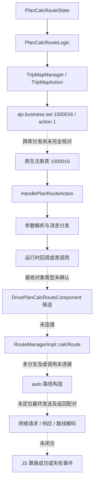

# 高德地图 App 协议分析：17.00.0.2005

2026-09-24。按用户要求，分析对象改为普通用户安装的高德地图 Android App。此前的开发者 SDK 实验不作为本报告的证据，不要求用户申请 Android SDK Key。

## 样本

- 官网：https://mobile.amap.com/cn/ ，移动下载页：https://wap.amap.com/ 。
- 下载页业务脚本引用配置：`https://mapdownload.autonavi.com/apps/apps/amap-official/amap-official/wap.json`。
- 该配置的正式版下载项为 17.00.0.2005，构建标记 `Build2609141129eBtwk8Ia3e-64`；测试版项为 17.01.0.1337。本次分析正式版，不将测试版称作正式最新版。
- 包名：`com.autonavi.minimap`，versionCode 170000，minSdk 21，compileSdk 34。
- APK 大小：195437758 字节。
- SHA-256：`022c844511dce2958fd37c8d0941feb72587a434701debc9b2fda3e69ec07152`。
- APK ZIP CRC 完整性检查通过；apksigner 验证退出码为 0，证书主体为 AutoNavi/minimap。校验工具同时报告部分 META-INF 元数据不受签名保护，不能将校验结果扩展为每个 ZIP 项都受保护。
- APK 内有 8 个 classes DEX、72 个原生库项。包含 ARM64 `libnavi_kit.so`、`libamaptbt.so`、`libamapaccount.so` 等。
- 本地 APK、官网下载配置、DEX 索引和 JADX 1.5.6 输出保存在 `.local-data/amap-app/`，不提交第三方安装包或反编译源码。

## 已定位的 App 代码

### 1. 路线入口

`com.amap.bundle.drive.DriveNaviService.requestCarResult` 把起终点、途经点等放入 PageBundle，再调用 `IRoutePlanService.startRouteResultPage`。这是页面/业务入口，不是已经确定的最终网络发送函数。

`com.amap.bundle.drive.navi.naviwrapper.NaviManager` 实现 `RouteObserver`，接收 `CalcRouteResult`，可见驾车、模拟、货车、摩托、巡航、HiCar 和新能源相关导航状态枚举。枚举存在不代表全部能力可以由一个远程接口直接获得。

### 2. 驾车请求封装

`com.amap.bundle.drivecommon.request.RouteCarParamUrlWrapper` 的 URL 注解使用 `DRIVE_AOS_URL_KEY` 主机配置和 `ws/mapapi/navigation/auto/?` 路径。

可见业务字段包括：

| 字段 | 代码中体现的用途 |
| --- | --- |
| fromX/fromY、toX/toY | 起终点坐标 |
| policy2 | 路线策略参数，具体取值尚待调用处验证 |
| viapoints、viapoint_poiids | 途经点 |
| carplate | 车牌 |
| angle、sloc_speed、sloc_precision 等 | 朝向、速度、位置精度相关信息 |
| contentoptions、route_version、sdk_version | 返回内容和协议版本相关选项 |
| output | 构造函数默认设为 `bin` |

该类在 App 业务代码中仍有引用，但不能仅凭类存在，就断言最新版主界面的每次算路都经过此旧路径。

### 3. 另一组路径登记

`com.autonavi.core.network.util.CoreInterface` 的路径集合包含：

- `/ws/transfer/navigation/auto`
- `/ws/transfer/navigation/routeguide`
- `/ws/navigation/dynamic/data`
- `/ws/aos/drive/batchguide`
- `/ws/shield/truck/route`
- `/ws/shield/motor-route/route`

这里确认的是代码登记的路径，不是已验证的调用成功接口；尚未确定运行时主机配置、实际策略、请求头和响应格式。不能把字符串清单当作 Python 可直接使用的 API 文档。

### 4. 签名与登录是两层机制

`AosURLBuilder.parse` 在合并公共参数和业务字段后调用 `Sign.getSign`，将结果作为 `sign` 放入参数表。`RouteCarParamUrlWrapper` 注解列出了参与该流程的起终点字段。

`Sign` 继续依赖 App 自己的 `serverkey` 渠道、应用信息及签名函数。这里没有要求外部开发者传入 Android SDK Key，也尚未证明“用户登录后复制一个 Cookie 就能独立调用”。未提取或发布内部密钥值。

`com.amap.network.api.http.request.AosRequest` 还定义了公共参数、加密、签名字段和 WUA 开关。这说明请求基础设施提供这些能力，不能据此断言所有导航请求都启用它们。

### 5. 响应解析有原生依赖

App 的 `com.autonavi.jni.ae.route.RouteService` 存在 `native decodeRouteData(byte[])` 和 `native decodeRouteTmcBar(...)`。网络边界接口 `com.autonavi.jni.ae.route.observer.HttpInterface` 定义 GET 和带 `byte[]` 的 POST 方法。

结合请求默认 `output=bin`，二进制路线响应及原生解析值得优先研究；尚未验证把 output 改成 json 是否受支持、是否包含同样的导航字段。也未判定字节流是否压缩、加密或使用某一种序列化格式。

## 第二轮：主机映射与旧响应封装

以下结论仍来自同一 APK 的静态代码，不是网络实测。

主机调用链为 `ConfigerHelper.getKeyValue(drive_aos_url)` → 标准键 `aos.m5` → `IHttpService.getHost` → 实现类 `k33.getHost` → `ky1.b`。`ky1.c` 初始化的生产默认值为 `https://m5.amap.com/`。因此旧请求封装在默认配置下指向该主机的 `ws/mapapi/navigation/auto/` 路径；运行时是否更改映射、是否重定向仍未验证。

旧响应链为 `RouteRequestNoCacheCallBack` → `RouteCarRequstCallBack.d(byte[])` → `h60.parser` → `RouteCarResultData.parseData`。包体布局如下：

| 位置 | 静态解析含义 |
| --- | --- |
| body 0–1 | 小端两字节标记，成功分支要求 200；不是 HTTP 状态码 |
| body 2–9 | 八字节小端整数，随后转为 Java int，作为扩展偏移 |
| body 10 起 | payload，整体交给原生路线解析器 |
| payload 的扩展偏移处 | 两字节小端扩展标记，100 表示打车费用分支 |
| 扩展起点 +2 至 +9 | 八字节小端文本字节数 |
| 扩展起点 +10 起 | UTF-16LE 文本，逗号分隔整数；费用单位尚未核实 |

`RouteCarResultData.parseDataEx21Version` 先读打车费用，再把整个 payload 交给 `RouteService.decodeRouteDataEx`。不能据此断言扩展前的字节已是可独立解析的标准格式，也没有证明它是 protobuf。

反编译交叉检查：`h60` 的普通输出出现矛盾分支，使用 simple 模式核对；`yr3.a` 普通输出丢失部分长整型强转，fallback 输出确认每个字节先转换为 long，再执行 8/16/24/32/40/48/56 位移。工具采用小端八字节读取，并拒绝 Java int 截断所产生的不合理偏移。

已保存离线研究工具 `tools/amap-app/inspect_envelope.py`，只读取本地响应，检查包头与扩展，**不会解码导航路线或发送请求**。六项合成测试覆盖截断、越界、非法文本、未知扩展等。尚无真实响应样本；合成测试通过不代表接口兼容性验证完成。

新版页面入口已追至 `RoutePlanService.startRouteResultPage` → `PlanHomeService.startRouteResultPage`。该入口根据 `NewPlanPageDataBuilder.e(routeType)` 与 PageBundle token 分流，存在旧 `PlanHomePage` 和新页面数据构建分支，不能把旧回调直接当作当前主界面唯一算路链路。

## 第三轮：新版页面与 AJX 桥接

`NewPlanPageDataBuilder.e` 的启用条件现已明确：

1. AJX 文件系统中存在 `path://amap_bundle_imobility/src/plan_page/PlanPage.page.js`。
2. `imobility_ailabs` 偏好中的 `new_plan_page`（或默认项）为字符串 `1`。
3. 对非空路线类型，`new_plan_route_type_list` JSON 数组中包含该类型的值。

`NewPlanPageDataBuilder.c` 构造页面 JSON 后，通过 `Ajx3Page` 打开上述路径，并在文件存在时指定 `plan_page_preload.js`。这证明有 App 内 JavaScript 页面分支，不代表该脚本能作为普通网页直接运行；当前设备的开关值也未经验证。

APK 内 `assets/ajx.bundle/bundles.oajx` 大小为 92,406,226 字节，头部为 `69 6f 6e 0a 30 30 32 00`。原始字节中未找到 `PlanPage.page.js`、`new_plan_page`、`/ws/transfer/navigation/auto`、`calcRoute`。这仅说明不能直接用明文检索定位这些内容，尚未判断其压缩、索引或加密格式。

已核对三个容易误判的桥接函数：

| 方法 | 实际可见行为 | 不能据此断言的内容 |
| --- | --- | --- |
| `ModuleRouteCar.requestRoute` | UI 线程调用注册监听器的 `startRouteCarResultPage` | 不是已定位的 HTTP 发送实现 |
| `ModuleRouteDriveResultImpl.requestCarRoute` | 调用注册的 `mJsCalcRouteCallBack`，传递字符串 | 方法名含 request，但这里是转交给 JS |
| `ModuleRouteDriveResultImpl.getRequestRouteParam` | 创建起终点/途经点上下文，通过 `z02.a` 构造 `RouteCarParamUrlWrapper`，序列化为 JSON 返回 | 参数 JSON 不等于接口返回 JSON |

最后一条把 AJX 桥接与前面找到的请求参数模型联系起来；仍缺少 JS 消费这些参数后实际发送网络请求的调用证据。`z02.a` 已保存反编译输出，但较复杂分支带有 JADX 警告，其具体策略条件不作为已验证结论。

后续优先定位 AJX 资源读取/模块注册及 JS 到网络或原生算路引擎的边界。应先取得调用链或真实请求样本，再决定 Web 适配方式，而不是继续依据方法名推测接口。

## 第四轮：AJX 网络桥接（2026-09-27）

继续分析同一个 17.00.0.2005 APK，本轮没有重新核实官方最新版本。

`AbstractModuleXMLHttpRequest` 明确声明模块名 `natives.XMLHttpRequest`，通过方法表导出 `allocReqId`、`sendHttp`、`abort`、`fetch`、`destroyBinary`、`binaryFetch`。实现类为 `ModuleRequest`，已确认以下静态调用边界：

| JS 桥接方法 | Java 实现行为 |
| --- | --- |
| `fetch` | 解析请求选项，构造 `AosRequest`，通过 `g30.e` 提交，使用 `AosStringResponse` 回调 |
| `binaryFetch` | 同样构造请求，设置 output 为 3，通过 `g30.e` 提交，使用 `AosByteResponse` 回调 |
| `sendHttp` | 通过 `v4.a` 构造 `HttpRequest`，交给 `AppInterfaces.getHttpService().sendHttp` |
| `destroyBinary` | 调用 `CAjxBLBinaryCenter.removeBinaryDataS` 释放二进制数据 |

`AjxBinaryCallback.onSuccess` 将响应字节交给 `CAjxBLBinaryCenter.addBinaryDataS`，回调 JS 的是 long 类型的结果句柄，而非响应 JSON 或原始字节。这里只确认通用桥接机制，尚未证明导航页面使用此方法，也尚未追到该句柄的导航消费端。

`optionsToRequestInfo` 读取 URL、method、headers、timeout 等选项；`aosSign` 控制公共参数、签名参数列表、加密和请求体参数策略。请求构造器再调用 `addSignParams`、`setWithoutSign`、`setEncryptStrategy` 等方法。这说明 AJX 网络能力包含 App 原生请求封装，不能直接等同于浏览器的标准 XMLHttpRequest；这些开关并不证明某个导航端点接受无签名请求。

另检查 `IAjxFile`，Java 接口仅暴露 `getLength()` 与 `readFullly()`，没有资源包格式实现；因此仍不能据此解开 `bundles.oajx`。

本轮本地证据：`.local-data/amap-app/ModuleRequest.java`、`AbstractModuleXMLHttpRequest.java`、`IAjxFile.java` 及各自 JADX 日志。反编译成功不等于运行验证，复杂的 `optionsToRequestInfo` 存在 JADX 分支警告，未把其中复杂控制流作为协议结论。

下一处缺口是 `PlanPage.page.js` 到这些桥接方法或原生算路方法的实际调用：需要继续定位 AJX 资源读取实现，或者取得 App 运行时调用记录。当前没有真实算路请求/响应样本，尚未实现可供 Web 调用的导航适配层。

## 第五轮：OAJX 外层索引与原生资源入口（2026-09-27）

资源读取链现已追至 `AjxFileInfo.getFileDataByPath` → `AjxBizFileInfo.GetBytesByPath` → JNI `nativeGetBytesByPath`。存在性检查同样最终进入 JNI。`AjxBizFileInfo` 在 `.js` 读取返回 null 或存在性检查失败时，会再尝试追加 `.wlm`，例如 `PlanPage.page.js.wlm`。这是路径回退机制证据，不能据此确认目标页面一定采用 WLM，也尚未确定 WLM 的内部格式。

`libajxbiz2.so` 中存在 OAJX header、bundle info table、bundle name table、file info table 的读取与越界错误字符串，以及 `AjxFileExplorer::getContentByFilepath`。这把资源包解析目标缩小到原生业务库；字符串本身不能代替完整调用图。

对当前 APK 的 `bundles.oajx` 完成了外层结构验证，以下字段含义由样本结构推断，尚非通用格式规范：

| 字节位置 | 本样本含义/值 |
| --- | --- |
| 0–7 | `ion\n002\0` |
| 24–27 | 小端 uint32 索引起点 48 |
| 28–31 | 小端 uint32 条目数 50 |
| 32–35 | 小端 uint32 名称区起点 1048 |
| 36–39 | 小端 uint32 名称区长度 1150 |
| 48 起，每条 20 字节 | 五个小端 uint32：未知字段、名称偏移、名称长度、子包偏移、子包长度 |

50 条名称范围恰好连续覆盖 `[1048, 2198)`；50 条子包范围恰好连续覆盖 `[2198, 92406226)`，所有边界合法，无尾部剩余字节。每个子包都以 `spx\n003\0` 开头。名称字节不是可直接使用的明文名称，尚未判定编码/混淆机制，未识别哪个子包对应 imobility。SPX 内部尚未解码。

新增 `tools/amap-app/inspect_oajx.py`：读取本地 APK 或 OAJX，检查上述已观察布局并输出索引，不解码脚本、不执行原生库、不发送请求。真实 APK 检查通过；四项合成测试覆盖正常布局、截断、非法偏移/长度、未知子包头和尾部多余字节。输出保存在忽略目录 `.local-data/amap-app/oajx-index.json`。

下一步应解析 SPX 子包的文件索引与内容读取过程，结合 `.js.wlm` 回退路径定位导航资源，再寻找具体算路调用。本轮仍未获取可读导航脚本或真实导航响应。

## 第六轮：SPX 文件名表解码，定位新版导航资源（2026-09-27）

本轮对 `libajxbiz2.so` ARM64 指令做静态分析，借助文件名表/文件索引越界错误字符串定位到 `0x11d534` 一带的加载逻辑。该地址仅适用于本报告的 APK。

确认 SPX 读取 480 字节头，`0x1c0` 是文件索引偏移、`0x1c4` 是名称表偏移、`0x1c8` 是名称表存储长度、`0x1d4` 是记录数。每条文件记录为 36 字节。名称表前四字节给出解压后长度，其余内容经过 RC4 处理再进行 LZ4 block 解压。RC4 状态初始化/字节处理分别在 `0x131c4c` / `0x131d0c`；名称表处理链见 `0x11d808`–`0x11d8a0`。名称表所用 16 字节材料由包头字段和 ELF hash 派生，未使用账号、会话或开发者 Key。

新增 `tools/amap-app/inspect_spx.py`，在当前 APK 的 **50 个子包全部成功解码文件名表，共 84,899 条记录**。每个名称表的解压长度、每条名称的 UTF-8 解码、连续范围和完整覆盖均校验通过。完整本地目录保存在忽略文件 `.local-data/amap-app/spx-file-index.json`，不把第三方资源内容加入仓库。

目标已定位到 **子包索引 23（第 24 个），amap_bundle_imobility**：

- `src/plan_page/PlanPage.page.js`
- `src/plan_page/PlanPage.page.js.config`
- `src/plan_page/plan_page_preload_tti.js`
- `src/plan_page/logic/PlanCalcRouteLogic.js`
- `src/plan_page/state/calc_route_state/PlanCalcRouteState.js`
- 其依赖目录中的 `RouteRequestManager.js`、`RouteConfigUtil.js`、`CarNaviCalcRouteParam.js` 等。

这些是成功解码的真实文件名，不是原始字节关键词猜测。不过文件名为 `.js` 仍不足以确认内容是明文 JS；**本轮只解出了目录，没有解出脚本正文，也没有证明这些文件运行时的调用关系**。记录中还有未解释字段，部分内容位置字段看起来不能直接作为子包内偏移使用，需继续核对原生文件读取逻辑和共享资源引用。

新增五项工具测试，覆盖 RC4 已知向量、LZ4 literal、重叠复制、截断/非法偏移和长度、SPX 头检查；连同现有检查工具共 15 项通过。下一步直接针对上述页面/算路逻辑资源解码正文，随后追踪实际调用。

## 第七轮：导航脚本正文与实际业务桥接调用（2026-09-27）

成功解码 `PlanPage.page.js`（303 字节）、`PlanCalcRouteLogic.js`（6,471 字节）、`PlanCalcRouteState.js`（24,108 字节），以及它们引用的两个 TripMapManager 模块、TripMapAction、TripMapConst 和 navikit 命令常量。本轮获得的是可读 JS 正文，不再只是文件名。

文件记录字段 2/3（从零计数）在本次目标样本中分别对应存储长度/解压后长度；字段 4 作为有符号 32 位相对偏移，加上当前子包的外层起点得到内容位置。负偏移指向更早子包中的共享内容。使用内容实际所属子包的包头派生材料进行 RC4 处理，再按目标长度 LZ4 解压，成功恢复上述文本。原生内容读取及处理链见 `libajxbiz2.so` 的 `0x11edac`–`0x11ef84`。该实现只覆盖已观察的格式，不宣称支持全部资源变体。

新增 `tools/amap-app/extract_spx_file.py`，从本地 APK 按完整资源名提取单文件，写入调用者明确指定的路径；不执行脚本、不发送请求。原始第三方正文仍仅保存在忽略目录 `.local-data/amap-app/`。本地/共享引用和越界测试新增两项，所有研究工具累计 17 项通过。

已读到的调用链：

1. `PlanPage.page.js` 加载 business，调用 `PlanPageLoader.start()`。
2. `PlanCalcRouteState._handleCalcRoute` 调用 `PlanCalcRouteLogic.calcRoute`。
3. 后者通过当前 route-type agent 的 `buildCalcRouteParams` 构造参数；经过校验和拦截逻辑后，调用 `TripMapManager.setMapAction(kRouteAction, kCalcRoute/kRestoreRoute, params)`。
4. `amap_bundle_lib_travel/src/trip_map/TripMapManager.js` 转导出 `amap_bundle_lib_travel_to_external/src/tripMap/TripMapManager.js`。
5. 实际 Manager 将动作和参数封装成 `{key, value}`，交给 `TripMapAction.setAction`。
6. `TripMapAction` 对该对象 `JSON.stringify`，随后调用 `ajx.business.set(command, json[, callback])`。

navikit 常量确认：`ENaviCommand.kRouteAction = 1000016`、`ENaviRouteAction.kCalcRoute = 1`、`kRestoreRoute = 2`。因此普通路径的桥接形态是 `ajx.business.set(1000016, JSON.stringify({key: 1, value: params}))`，这里的 params 是已构造的内部参数，不是已验证可发送的 HTTP 请求。

`PlanCalcRouteState` 注册了算路成功、失败事件，并在结果处理里消费路线集合。该脚本链路没有直接走先前研究的 `natives.XMLHttpRequest.binaryFetch`；不能据此排除其他模式使用 HTTP 桥接，但不再应把它当作本链路已证实的下一跳。

目前确认的是静态源代码分支，仍未运行 App 验证当次配置或网络。下一步转向 `ajx.business.set` 的原生命令分发和 route-type agent 参数构造，定位 `1000016 / 1` 对应的算路实现，再查网络请求和响应转换。

## 第八轮：驾车参数与 Horus 命令处理目标（2026-09-27）

继续解码 `PlanRouteTypeAgent`、其 Config、`PlanCarAgent`、`PlanBaseAgent`、`PlanDriveCalcRouteHandler` 和 `RouteConfigUtil`。CAR 配置指向 `PlanCarAgent`；其继承的 `PlanBaseAgent.buildCalcRouteParams` 调用 `PlanDriveCalcRouteHandler.getCalcRouteParams`。

可见的普通算路参数包括 `startPOI`、`midPOI`、`endPOI`、`invoker`、`requestId`、`calcType`（缺省 0）、`routeMode`，以及条件加入的 `cloud_id` 和 `commonParams`。基础参数由 `RouteConfigUtil.getRouteParams` 补入 `enableLongDistMultiPath`、`enableReasonPath` 和可选 `vehiclePlateList`；前两个受云配置/特性开关影响。恢复路线另带 `restoreParam`、`routeParam` 和 `invoke: 1`。

注意：偏好、限行、车型等并非全部存在于这次命令对象。`PlanDriveCalcRouteHandler` 的初始化/设置逻辑还经 `TripMapManager.setMapConfig` 等通道设置导航配置，`RouteConfigUtil` 分别生成 preference、restrict、energy 等配置。独立重放算路命令可能丢失先前设置的状态，不能仅凭当前 JSON 字段宣称可复刻完整 App 算路行为。

原生层将重点范围缩小到 `libamaphorus.so`：其中保留 `mk::cmd::nk_plan::HandlePlanRouteAction`、`HandlePlanCalcRouteAction`、`mk::cmd::nk_guide::HandleRouteAction` 的函数名诊断字符串，以及 `CalcRouteServiceImpl`/`RouteManagerImpl::calcRoute` 的相关字符串。`libnavi_kit.so` 包含 `AjxBLFactoryImp::createObject` 等业务控制对象工厂信息。这些字符串只是定位线索，尚未形成跨库完整调用证据。

通过 `HandlePlanRouteAction` 字符串引用定位到当前样本 `libamaphorus.so` 的 `0xbca60c` 附近函数。已检查该函数动作跳转表（`0x1575d2`）：动作 1 跳至 `0xbca67c`，动作 2 跳至 `0xbca7e8`。动作 1 分支进入参数解析调用 `0xcb2784`，随后根据解析结果分流。地址仅适用于本 APK；尚未证明 `ajx.business.set(1000016, ...)` 在实际运行配置下一定进入这个函数，也尚未把这些分支连接到最终 HTTP 发送函数。

Horus 库另含 `/ws/transfer/navigation/auto/` 相关路径字符串，但没有以此作为本算路分支的已验证最终端点。下一步应连接业务控制对象的命令注册/分发与上述处理函数，并继续追参数解析后的具体服务调用。仍无运行时请求和真实响应样本。

本轮为静态分析，没有改动媒体中心功能，也没有发送高德内部网络请求。本地新增证据保存在 `.local-data/amap-app/` 的上述脚本、`libamaphorus.so` 和 `horus-disasm.txt` 中。

## 第九轮：确认原生命令注册关联（2026-09-27）

原生命令与处理函数的关联得到指令证据，不再仅依赖诊断字符串：

- `libamaphorus.so:0xbc70f4` / `0xbc7100` 将 `w24` 设置为 `0x000f4242`（1,000,002）。
- `0xbc7218` 计算 `w24 + 0xe`，即 **1,000,016**，并通过 `0xbcc9a0` 将该值写入注册辅助函数使用的键位置。
- `0xbc7224` 取得处理函数地址 **`0xbca60c`**，随后 `0xbcc9ac` 将函数指针存入关联位置；此地址是前轮由 `HandlePlanRouteAction` 诊断字符串定位到的函数。
- 同一处理函数还在 `0xbc751c`、`0xbc7810` 注册；本轮未为这些注册路径命名具体运行场景。

因此已经连接上 **JS 常量 1000016 → 原生注册关联 → HandlePlanRouteAction**。但 `ajx.business.set` 跨库调用及运行时选择哪套注册表仍未完整追踪，不能将静态关联写成已运行验证的全链路。

动作 1 的静态分支继续经 `0xcb2784` 解析参数，根据解析出的字段进一步分流。在可见分支末尾，`0xbcd7a0` 转入 `0x54ebdc`，该函数获取对象集合后逐项调用 `0x54ee40`；后者遍历条目并调用 `0x54f094`。这是后续分发过程的指令证据，暂未确认这些条目的具体类名或消费者，不把它直接标注为 HTTP 发送。

另外通过 ELF 动态符号确认 `NaviModeCycleLifeManager::SetCommandProcess` 位于 `0xbce42c`，`INaviEngine::fetchCalcRouteService` 位于 `0xae8414`。它们是下一步可核对的具名入口；尚未证明当前分支直接调用算路服务入口。

精简指令证据已保存在忽略目录 `.local-data/amap-app/route-command-evidence.txt`。本轮没有修改提取工具、执行 App 或发出高德请求。剩余重点是识别分发条目的消费者和最终算路服务调用，再定位网络层。

## 第十轮：跨运行时回调的缺口与网络端定位（2026-09-27）

用户要求继续直到完整链路。本轮扩大到分发对象、路线组件、网络构造及模拟器条件的交叉检查；**目前仍不能宣称完整调用链已经找到**。

已继续追到消息任务构造：`0x54f094` 分配对象，经 `0x54f1a8` 设置虚表 `0xdce410`；ELF RELA 表确认其三个函数项为 `0x54f234`、`0x54f27c`、`0x54f2a0`。最后一个函数在条件满足时，取对象 `+0x18` 的回调对象，调用其虚表 `+0x18` 项，参数为任务 `+0x38` 的数据。对象来自前面的运行时订阅条目，尚未确定该条目在目标场景绑定的具体类型。不能把附近的 DrivePlan 类名直接当作这个间接调用的目标。

从另一端定位到 `DrivePlanCalcRouteComponent` 的错误/切换/结果回调相关函数（通过对应诊断字符串及引用核对），以及 `RouteManagerImpl::calcRoute` 的 `0xc4a61c` 附近函数主体。后者有多个分支，可见一个分支经 `0xc4ae5c` 继续处理，且包含多个虚函数调用和策略选择，尚未与上述消息消费者连接。

网络构造端已有具体引用：`0xc6e784`–`0xc6e790` 构造 `ws/transfer/navigation/auto/?` 路径字符串；邻近分支还有带固定参数的该路径。这里仅确认构造位置，不等同于最终发送位置，更未证明当前主界面算路一定选择该分支。

当前证据图（实线仅表示前文已核对的局部静态调用/关联；虚线是未完成连接）：

动态条件复查：adb 仍无设备，本机未安装 emulator。重新读取 Google 官方 `sys-img2-3.xml` 并对镜像做 Range 请求：Android 30/31/32/33/34 清单大小依次为 1438186618 / 1470822277 / 1538792859 / 1707857511 / 1563721130，而服务器返回总长为 1431250880 / 1462764831 / 1530607310 / 1695377537 / 1555793355。未将这些不匹配下载视为经校验的可用镜像，也没有运行它们。

现阶段可靠的闭合方式是取得可验证的 App 运行环境，记录目标命令实际接收对象/函数地址、网络发送与返回，再回填静态图；或者继续恢复完整的订阅注册关系和对象生命周期。尚无证据允许跳过这些间接调用直接串出完整链路。没有使用 SDK Key，没有调用内部算路端点。

## 第十一轮：Python HTTP 实测基线（2026-09-27）

不以 Android 模拟器为前置条件，新增 `tools/amap-app/http_baseline.py`，实际发送四次 HTTPS GET：两个静态发现的路径，各测试最小参数及旧构造器默认参数。使用固定研究坐标，不使用用户位置、账号会话、提取凭据或猜测签名；TLS 校验启用，不自动跟随重定向，无自动重试。

| 路径 | 最小参数 | 补齐旧构造器默认参数 |
| --- | --- | --- |
| `https://m5.amap.com/ws/mapapi/navigation/auto/` | HTTP 200；113 字节 JSON；`result=false, code=3, message=Params error` | 同样业务错误 |
| `https://m5.amap.com/ws/transfer/navigation/auto/` | HTTP 200；0 字节；`application/octet-stream` | 同样空响应 |

本次没有路线成功结果。HTTP 200 不代表算路成功；空包不代表有效二进制路线。旧参数模型用于 transfer 路径仅作为探索性基线，尚未证明两者兼容。最小请求与补齐默认值都未加入签名/公共设备参数，不能从错误结果判断端点失效、账号要求或具体缺失字段。

原始响应与请求参数/状态/摘要分别保存在 `.local-data/amap-app/http-baseline-20260927/` 和 `http-baseline-20260927-defaults/`；JSON 内容的摘要不同可能来自时间字段，不视为业务结果变化。运行命令：`python tools/amap-app/http_baseline.py`，对照版本加 `--defaults`。重复运行会覆盖对应目录内同名研究结果。

同步反编译 `NetworkParam`，确认 `getNetworkParamMap` 还会添加 div/siv、设备标识类字段、session/appstartid/stepid、channel、网络/语言等公共字段，部分按条件加入 uid。`AosURLBuilder` 合并它们后生成 sign；旧路线注解指定 fromX/fromY/toX/toY 为签名字段，`Sign.getSign` 进一步依赖 serverkey 的渠道和 App 内部材料。仅确认该链，不把这些字段全部判为服务端必填，也没有认为 uid 条件出现就证明登录必要。

下一项验证应依据代码补全必要公共参数与签名构造，并先确认 transfer 分支的真实请求形式，再进行受控对照；不以无依据的参数枚举代替协议还原。Python 路线可继续推进，模拟器只在具体运行时依赖无法静态恢复时作为补充。

## 第十二轮：无需 Android 系统的 JNI 注册模拟与签名算法（2026-09-27）

本机已具备 Unicorn ARM64 指令模拟能力。本轮建立本地实验脚本 `.local-data/amap-app/map_serverkey_jni.py`，映射 `libserverkey.so` ELF 段和重定位，为内存分配及 JNI 注册所需调用提供最小桩，执行 `JNI_OnLoad`。共记录 33 个注册方法，映射保存在 `serverkey-jni-map.json`。这验证了在无完整 Android 系统情况下继续还原原生代码的可行性。

注意：JNI 桩并未实现 Android 包管理、应用签名校验或真实 Java 对象语义，因此注册表提取成功**不等于所有方法已能独立正确执行**。未调用渠道/密钥方法读取其返回材料，也未伪造包签名或登录态。

当前 APK 对应地址：`sign = 0x6f50`、`getAosChannel = 0x3650`、`getAosKey = 0x3bb0`。结合注册阶段的 Java 方法绑定及 `sign` 指令确认：

- 使用 `java/security/MessageDigest.getInstance`，传入字符串 `MD5`（原生常量位置 `0x9f0`）。
- 对调用者传入的 byte[] 执行 `update` 和 `digest`。
- 结果每字节拆成高低四位，经 `0123456789ABCDEF` 表（`0xdf0`）转换，输出大写十六进制。

与先前 Java `Sign.getSign(String)` 对照，该入口签名形式为 `UPPER_HEX(MD5(bytes(channel + businessString + "@" + aosKey)))`。原 Java 使用无显式 charset 的 `getBytes()`；当前研究参数为 ASCII，不据此扩展断言任意 Unicode 参数的编码规则。

仍需完成两项才能进行有依据的签名 HTTP 对照：核对 `yv6.b` 的业务参数拼接/顺序/空值处理；核对渠道与内部材料获取的初始化依赖。这里只确认旧 `AosURLBuilder → Sign` 路径，未证明新版原生 transfer 请求采用同一签名入口。本轮没有发送新的 HTTP 请求，也没有生成成功路线响应。

## 第十三轮：签名请求取得有效外层二进制响应（2026-09-27）

`yv6.b` 已核对：按照注解数组给定顺序取值，跳过 null，直接追加对象字符串；没有分隔符、不排序、不先 URL 编码。当前旧路线注解顺序是 fromX、fromY、toX、toY。

`getAosChannel/getAosKey` 会通过包签名证书字节执行检查。当前 APK 的 META-INF RSA 中证书 DER 为 609 字节，按原生有符号 byte 累加得到 13686，与指令常量 `0x3576` 相符。实验使用此 APK 的真实证书数据，没有修改比较指令；通过隔离 JNI 桩提供证书数组和字节读取，执行原生 getter，取得渠道和内部材料。桩替代了 Android 包管理调用，因此这是函数隔离验证，不是完整 App 运行验证。敏感返回值仅在进程内用于请求，未打印或写入报告。

以固定坐标及既有最小参数加入 channel/sign 后，Python 实际 GET 旧路径 `ws/mapapi/navigation/auto/` 得到：

- HTTP 200，`application/octet-stream;charset=UTF-8`，**1,838 字节**。
- 外层包标记 **200**，payload 1,828 字节，扩展偏移 1,814。
- 扩展标记 100，UTF-16LE 费用整数列表 `[13]`，单位仍未核实。
- 所有外层边界检查通过，没有未解析的尾部字节。
- SHA-256：`0bc382978aa255d1e074cb847eff8468ffb00969d5e7f06bdb8f0ae69e7a7b91`。

这是第一次取得符合已还原旧协议成功外层的真实响应，明显不同于无签名的 Params error。**路线主体仍未解码，不能据此报告路线数、里程、耗时、路况或已经可用于 Web 导航。**本次没有提供账号登录态，说明至少此请求取得上述响应不依赖用户登录；不扩展为所有功能都不需要账号。

仅将 output 改为 json（其余业务签名输入相同）后，得到 HTTP 200、241 字节 JSON，业务 `result="false", code="2", message="Failure."`。因此这个对照未得到可替代二进制路线的 JSON；不能宣称接口普遍不支持 JSON。

实验脚本与原始结果位于忽略目录：`verify_signed_baseline.py`、`signed-baseline.bin`、`signed-baseline-summary.json`、`verify_signed_json.py`、`signed-json-baseline.bin`、`signed-json-baseline-summary.json`。脚本不包含硬编码提取密钥，但涉及内部材料复现，暂不加入项目功能或推送。

下一步应以该真实二进制样本校验路线主体结构/原生解析器，并检查更丰富路线参数；新版 transfer 路径尚未完成签名请求验证。Android 模拟器已不再是本研究前置条件。

## 第十四轮：原生入口与双样本道路摘要（2026-09-27）

已从 APK 提取 `libamaptbt.so`（16,220,880 字节）。其 JNI 注册表 `0xf44550` 的方法名为 `decodeRouteData`，签名为 `([B)Lcom/autonavi/jni/ae/route/route/CalcRouteResult;`，对应函数 `0x4a8c7c`。函数先读取 Java byte[]，调用 `0xcf7e5c` 获取服务对象，再通过服务 vtable[0] 获取解析对象，调用该对象 vtable[8]，参数包括字节指针、长度与结果容器。之后封装 Java 结果。`0xcf7e5c` 从全局 `0xf93658` 读取服务，必要时从 `0xf93660` 工厂间接获取。具体解析对象的动态类型仍未锁定，不能把这一入口当作已完成原生解码。

新增一次固定坐标对照：仅将终点经度从 116.4100 改为 116.4200（重新签名），纬度仍 39.9160。HTTP 200 返回 6,705 字节，外层校验成功，主体 6,675 字节，费用扩展整数 `[13,20]`。SHA-256 为 `686b376d9d9bbb8930ec73587da81a23355ae197e756e1dcbad64aeb9ad14252`。原始文件 `signed-east-control.bin` 及实验脚本均在忽略目录，不包含在产品中。

两个样本共同支持以下**候选前缀结构**（偏移相对去掉 10 字节外层后的 payload）：

- offset 0 的三字节小端整数恰好等于外层给出的主体长度。
- offset 52 的字节分别为 1、2；从 offset 87 开始可连续解析对应数量的道路摘要组。
- 每组：一字节记录数；每条记录为一字节未知类型、一字节 UTF-16 字符数、UTF-16LE 文本、五字节未知尾部。
- 所有组后跟两字节字符数及连续 UTF-16LE 名称表。两个样本均能读到完整中文道路名，随后分别在 offset 222 和 409 进入未解析区域。
- 第一份摘要含内部道路、东华门路、东华门大街、东安门大街。第二份第一组含金鱼胡同、金宝街，第二组含西华门大街、南长街、西长安街、东长安街、东单北大街、干面胡同。

摘要组数与费用项数一致，支持“按路线分组”的假设，但尚未由原生解析代码证实，输出仍命名 `group_count_candidate`。曾尝试只解析一组后读取名称表，第二样本立即 UTF-16 解码失败；改为使用 offset 52 的组数后两份样本均成立。这是对照实验得出的修正，不是通用协议保证。

第一份样本 offset 0xeb 的两个 uint32 为 26817975、9194964，除以 230400 后为 116.3974609375、39.9086979167，与输入起点接近。这只是坐标比例候选，尚未证明坐标系、后续节点边界或完整轨迹，未输出可用导航折线。距离、耗时、转向及路况仍未解码。

新增离线工具 `tools/amap-app/inspect_route_prefix.py`，明确标记为双样本实验前缀读取器，仅接受已观察的头部特征，检查字段越界；不能替代 App 解码器。新增四项测试（多组、未知头部、长度越界、截断），研究工具累计 21 项测试通过。两份真实样本读取结果保存在忽略目录 `*-prefix.json`；剩余未解析主体分别为 1,592 与 6,266 字节。

## 第十五轮：节点表、候选共享引用与跨库注入点（2026-09-27）

### 原生服务连接

`libamaptbt.so` 的 `createTBTModule`（`0x4aba10`）调用构造函数 `0x4abadc`，写入 vtable `0xf447a0`。其槽位 `+0x148` 为 `0x4abd58 → 0xcf7e00`，写全局服务 `0xf93658`；槽位 `+0x240` 为 `0x4ac144 → 0xcf81d8`，写工厂 `0xf93660`。这两处与第十四轮解码入口读取的全局一致。

`libamaphorus.so` 的初始化段 `0xbcddf0..0xbcde18` 从持有对象的 `+0xd0` 读取工厂，经 vtable[8]、返回对象 vtable[0x28] 获取服务，再调用目标模块 vtable[0x148]；`0xbcdf40..0xbcdf50` 将同一工厂传入目标模块 vtable[0x240]。工厂来自 `0xbcd958` 的 x2 参数，调用方 `0x5677d4` 从配置对象 `+0x30` 取出。槽位及数据流与 TBT 服务注入吻合；配置中工厂的实际动态类型尚未解析，不据此声称已经得到最终字节读取函数。

### 节点记录与名称引用

从前缀读取器停止处继续，两份样本均可按以下候选规则完整读取一张表：uint16 记录数；每条 11 字节头（前四字节为候选长度数值，后六字节未知，第 11 字节为名称 UTF-16 单元数）；名称非空时跟 uint16 名称表偏移；最后两个 uint32 为候选坐标。名称索引按 UTF-16 code unit 处理并校验边界。

- 第一份节点数 10，表结束 payload offset 428。
- 东移对照节点数 28，表结束 offset 985。
- 全部名称索引均位于前述名称表内，返回东华门路、金宝街等合理道路名。
- 坐标除以 230400 后位于固定测试区域；首坐标与请求起点接近。坐标系、比例及字段语义仍待原生代码验证，不能用于导航。

摘要五字节尾部的试探拆法为 uint16 起始值、uint8 数量、uint16 未知标志。各组内部区间连续，但对照两组终值是 13、18，合计 31，**不等于节点表的 28**。因此不能把摘要数量直接当节点数，也不能顺序分成 13+15。这一试探性分组曾在过程说明中提出，已被校验推翻。

在节点表后的数据里，手动定位了候选六字节引用记录：三字节未知 flags 加三字节节点索引，均为小端。

| 样本 | 手动指定起点 | 数量 | 索引序列 |
| --- | --- | --- | --- |
| baseline | 452 / 0x1c4 | 10 | 0..9 |
| east-control 第一段 | 1027 / 0x403 | 13 | 0..12 |
| east-control 第二段 | 1139 / 0x473 | 16 | 13,1,14..27 |

两段共 29 次引用，复用索引 1 后恰好覆盖全部 28 个节点。这为节点共享提供了具体证据，但这些引用表的头部/边界尚未通用解析；数量与定位是人工实验输入，不是自动发现的路线结果。按引用累加四字节候选长度数值为 1985、2854、5341，未确认单位，不能作为已验证米数展示。耗时、完整折线、路况和转向仍未还原。

新增 `inspect_route_nodes.py`，支持节点结构检查与显式 `--reference-run OFFSET:COUNT` 离线校验。所有输出保持 `native_route_decoded=false`、`complete_polyline=false`；不自动猜路线分组，不接入产品。两份真实结果保存为忽略目录 `*-nodes.json`。新增七项节点/引用测试，研究工具共 28 项通过。本轮没有新增 HTTP 请求。

## 第十六轮：三样本自动定位引用记录（2026-09-27）

新增一次固定终点经度 116.4300、纬度 39.9160 的签名对照，其余测试起点和请求参数不变。HTTP 200 返回 5,195 字节；外层成功，主体长 5,165，费用整数 `[15,16]`。SHA-256 为 `7cd117daa0eca17f361c8ce597cf1a7685b3018f738e53221ec02109a03d1d68`。忽略目录保存 `signed-far-east-control.bin` 与对应脚本/元数据，无账号登录态。

第三样本可沿既有前缀和节点规则读出 22 个节点，节点表结束 offset 938。三样本共同支持一个不需要手工偏移的**实验性引用记录规则**：

1. 节点表后紧接 10 字节头；头部 offset 1 的 uint16 指定引用数，offset 9 的 byte 指定标签数。首 byte 在样本中为 0 或 128，其他字段暂保留原始值。
2. 每个标签由一字节未知类型、一字节 UTF-16 单元数、对应 UTF-16LE 文本、一字节 0 组成。
3. 三字节 `02 00 00` 后为引用记录，每条仍是三字节未知 flags 加三字节节点索引。
4. 随后 12 字节尾部在已观察样本中匹配 `01 00 0a XX 00 00 04 00 00 00 00 fd`。保留 XX 及全尾部原始值，不推断其含义。
5. 按前缀组数继续读取下一组。整个过程不搜索匹配字节串，也不手填记录偏移。

三份结果：

| 样本 | 引用数 | 标签 | 全部引用记录结束 | 剩余未解析主体 |
| --- | --- | --- | --- | --- |
| baseline | 10 | 大众常选 | 524 | 1290 |
| east-control | 13、16 | 大众常选/时间短/距离短；备选二 | 1247 | 5428 |
| far-east-control | 17、16 | 推荐；大众常选 | 1204 | 3961 |

第三份第一组索引为 0..16，第二组为 0..10,17..21，提供了多节点复用的额外对照。由自动规则得出的 baseline/east 偏移与前一轮人工定位一致。按候选长度数值累加第三份两组为 3804、3912；依旧没有确认单位或耗时，不用于产品展示。

新增 `inspect_route_records.py`，对未知头部、标签终止、引用索引、尾部以及越界严格报错，输出保留实验标记。新增五项测试，覆盖多标签、非 BMP 字符、节点复用、每个截断位置、非法索引和未知头尾；研究工具累计 33 项通过。三份真实样本输出保存在忽略目录 `*-records.json`。

记录后剩余数据开头在三样本中有长段相同字节，符合起点附近共享数据的可能性，但其几何/路况格式仍未解码。`libnavi_kit.so` 的依赖符号进一步显示 `INaviKitEngineDepsFactory` 接口；Java `HorusInitConfig` 只有资源、数据库、存储、设备标识等字段，没有直接给出路线解析器的类型，不能从该 Java 类直接补齐工厂实现。

这一轮完成的是**三样本的自动记录边界和引用读取**，不是完整原生解码。新版 transfer 链路、原生解析工厂的动态类型、精确耗时、坐标系和完整道路折线仍未完成。

## 第十七轮：主体分块闭合与部分相对坐标验证（2026-09-27）

本轮不新增网络请求。引用记录之后的数据可按以下候选头部连续划分：uint16 块总长度（含头）、uint16 组内序号、uint8 组号、uint8 flags。每个引用对应一个块，按路线记录顺序排列。不能按全局唯一节点数读取，否则会漏掉复用节点的块。

三份样本分别包含 10、29、33 块。块长度累加最终精确到达 payload offset 1814、6675、5165，与外层扩展偏移全部一致。每块的组号/组内序号均与引用顺序一致。至此三样本主体的**长度分帧**闭合；块内尚有未解释内容，绝非“完整导航协议已解码”。

进一步观察到部分简单块（flags=5/7）具有长度标记的元数据、可选 UTF-16 名称、属性组和路段记录。坐标候选字段的 uint16 高两位表示编码模式，低 14 位为点数：模式 0 对应两个有符号 int16 增量，模式 1 对应两个有符号 int8 增量。以节点表的整数坐标为起点逐次相加。

首份样本前四个块有独立的交叉检查：

| 组内节点 | 路段长度候选值 | 累加终点原始坐标 | 与下一节点 |
| --- | --- | --- | --- |
| 0 | 186+92+155+17=450 | 26817932,9195901 | 精确一致 |
| 1 | 57+22=79 | 26818148,9195906 | 精确一致 |
| 2 | 539 | 26818957,9196448 | 精确一致 |
| 3 | 88+19=107 | 26819246,9196456 | 精确一致 |

每个块同时满足内部游标到达块尾、长度数值和等于节点表数值、终点原始坐标等于下一引用节点。第二、第三份共享前缀也通过同一规则。仍未确认坐标系和长度单位，原始整数坐标吻合不替代这些验证。

新增 `inspect_route_blocks.py`：完整校验外部分块；对尚不支持的 flags/字段布局保留 `unsupported` 及原因，不输出截断折线。当前每份样本各有 7 个块通过有限几何解析；分别另有 3、22、26 个块未支持。第二/第三份有 flags=1 的复用块，不能将其当作空道路；尚未实现其属性复用规则。

工具保留 `native_route_decoded=false`、`complete_polyline=false`。`framing_consumed_all=true` 和 `unparsed_native_bytes=0` 只表示没有未划分的主体字节；`uninterpreted_geometry_block_count` 单独记录未解码几何的块数。剩余标量没有擅自命名为速度/耗时，未知位掩码会拒绝解析。

新增七项测试，覆盖两种有符号坐标模式、几何截断、未知 flags、跨组序号、非法长度、错误索引及未划分尾部。研究工具共 40 项测试通过，真实输出保存在忽略目录 `*-blocks.json`。原先名为 `libdecode100203b46520.so` 的库经导出符号检查为支付宝扫码相关，排除为路线解码器候选，不继续沿名称误导的方向追踪。

## 第十八轮：新响应回归与 TMC 实验入口（2026-09-27）

本轮新增同一起终点的真实 HTTP 复测。原 1,838 字节单组响应变为 2,858 字节、两组候选路线、18 个详情块；说明不能把固定样本的路线数或结构当作接口不变量。TMC 六位小数坐标请求又取得 2,896 字节响应，在旧记录尾部断言处失败（`unknown record trailer profile`），保留原始字节供追踪，没有放宽断言强行继续。

修正此前将路段标记当作固定 uint16 并按位累计可选长度的假设。当前按单字节标记、条件扩展字节、两个可选四字节字段、描述字段及条件七字节记录读取。这仍是样本驱动的候选布局，不是原生解析器规范。模式 2 的直接 int16 增量尝试导致终点不一致，已撤回；不支持的模式继续拒绝。

保留块边界、长度数值和、下一引用节点原始坐标三重检查。旧三样本通过局部检查的块数由各 7 个增至 8/10、16/29、13/33；新 2,858 字节样本为 10/18。并非所有剩余块仅是缺字段：有的已能走到块尾，但终点不一致，例如旧第一条路线第 4 块候选终点偏差为 (-16,-1) 原始坐标单位，不能添加人为修正量掩盖问题。

新增 `verify_corpus.py` 输出可重跑的样本矩阵，结果保存在忽略目录 `verification-matrix.json`。仍无任何样本达到导航可用标准，`navigation_ready=false`。

用户要求新增 TMC 应用，已建立 `/#/apps/amap` 的**实验入口**和受登录保护的 Python 适配接口。隔离进程用本地固定版本资源发送真实请求，不提交或回传签名材料。道路摘要前缀可以独立校验时，仅展示文字；主体不支持时保留「尚未解析」状态。不画截断折线，不显示未经确认的公里数/分钟数，不提供导航引导。可运行条件和接口边界见 `docs/amap-tmc-integration.md`。

本轮并没有完成用户要求的「剩余验证全部通过」。完整解码仍是明确未完成项，实验入口不可表述为已移植高德 App 导航。

## 当前结论

App 路径已确认与开发者 SDK Key 接入不同。已定位业务入口、请求封装、接口路径集合、签名入口及原生解析入口，具备继续追踪的具体目标。

已进行静态分析及固定坐标的 Python HTTP 验证，取得多份符合旧路径成功外层的二进制响应，读出候选道路摘要、节点和引用记录，并完成部分响应主体分帧及相对坐标交叉验证。没有运行完整 App、登录账号或完成路线主体解码；仍未证明协议可完整独立移植。TMC 现有实验请求/摘要入口，但尚无可用的 App 导航实现。

## 下一步验证顺序

1. 沿主界面的真实算路调用追踪新旧请求路径，确定实际发送类及主机选择。
2. 继续跟踪原生解析对象的工厂/虚表和二进制字段，用固定坐标 HTTP 对照验证；完整 Android 运行环境仅作为可选辅助，不是前置条件。
3. 记录业务结果和网络原始字节，核对路线数、距离、时间、坐标、路况与收费；优先确认是否存在同等内容的 JSON 返回形式。
4. 确认请求与响应可独立处理后，再设计 Python 适配层和 Web 展示。不能用“找到了 URL”代替完成协议验证。

## 第十九轮：实际协议 5.1 与地图导航（2026-09-27）

此前 2.5.3 分析并非当前 native 引擎所用协议。RouteService.getRouteSdkVersion → JNI getRouteVersion 的 0x4a8bd4 读取字符串 0xcb863=`5.1`。改为 5.1 后获得 32 字节主头、32 字节记录头、Zstandard 压缩的 Protobuf。assembly_kit 的 DrivePathCodecImpl 0x714e0 → 0x7124c/0x71378 → 0xb60c8 对应主路线解码，codec 独立字符串 4.0 不能代替 HTTP route_version。

新增 route_v51.py，保留旧 inspect_* 作为旧格式研究记录。新响应字段：外层 1=头（版本 51、状态 0）、2=路线容器；容器 5=UTF-8 名称池、7=重复候选；候选 10=路段；路段 3=links、4=坐标；坐标 1/2=分别经纬度 packed zigzag 增量，段内累加除 3600000。link 8=坐标起点索引/数量，7.9=名称池字节范围。route.1/100 与几何长度交叉验证，不用于伪造测距或 ETA。

真实样本 signed-version51.bin（1824 字节）、signed-v51-east.bin（2079 字节）、signed-v51-hangzhou.bin 均通过几何/完整 link 覆盖检查，合计 5 条路线。旧格式出现的约 6 米路口差异在独立新版 protobuf 坐标也出现，证明不能把该差异一律视为漏读尾点。显示层保留分段间隙，不补直线。

已接入 TMC 地图页面、真实算路、模拟回放、浏览器实时定位、几何转向、语音和偏航重算；本机模拟走到终点。具体运行依赖、验收与未实现能力见 amap-tmc-integration.md；尚未做车机 GPS 实车测试。
